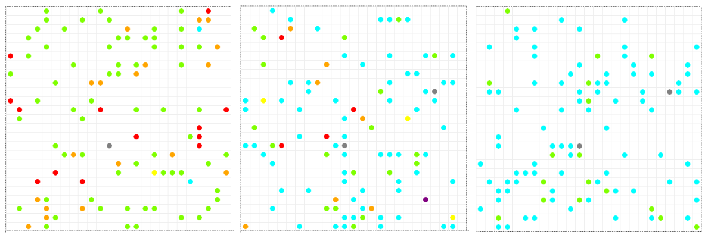
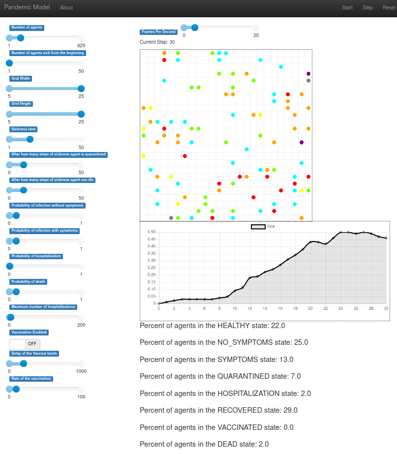

# Pandemic Among Agents
**Simulating pandemics with agent-based modelling using mesa library**

This is a project for the course in Artificial Life at the Poznan University of Technology.

The Mesa library can be found at [this link.](https://github.com/projectmesa/mesa)

# Agents
There are 8 possible agent states:
1. HEALTHY (light green)- default state,
2. NO_SYMPTOMS (orange) - is sick and can infect others,
3. SYMPTOMS (red) - is sick and may infect others but is quarantined after some time,
4. QUARANTINED (yellow) - cannot move, cannot infect others, and must wait for quarantine to end,
5. HOSPITALIZATION (purple) - like QUARANTINED, but occupies one place in the hospital,
6. RECOVERED (cyan) - was sick and cannot be sick anymore,
7. VACCINATED (dark green) - cannot be sick,
8. DEAD (grey) - died.

# Model
Our model utilizes RandomActivation scheduler and SingleGrid from mesa library.

Simplified behaviour:
At each stage of the simulation, each agent (in a random order),
takes action, depending on their state, that include:
- moving one cell on the grid,
- infection of agents in the moore (8-cell) neighborhood,
- countdown to the end of illness or quarantine,
- change of state, if necessary.

When an agent agent finds itself in the neighborhood of an agent in the NO_SYMPTOMS or SYMPTOMS state,
it is infected with a user-specified probability for a given time. If the HOSPITALIZATION state is drawn
and the current number of agents in that state exceeds the set limit, the agent automatically dies. If his state is
SYMPTOMS or QUARANTINED, he may also die with a certain probability after a specified number of steps.

# Simulation
The illustrations below present 3 stages of the epidemic: step 20, step 40 and step 60 of the simulation.
In the last picture you can see the herd immunity.

# Server
The server uses ModularServer from mesa to create interface with sliders, chart, custom text elements,
and, most importantly, a grid with agents.
The user can change the course of the simulation using 15 available parameters.

